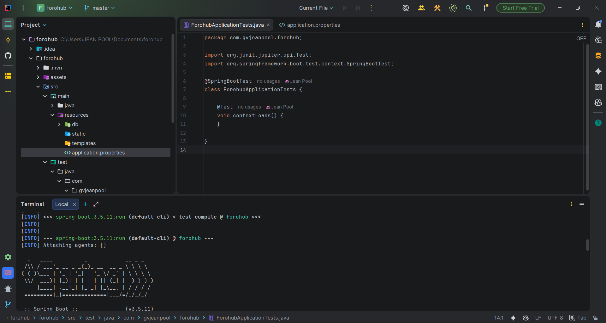
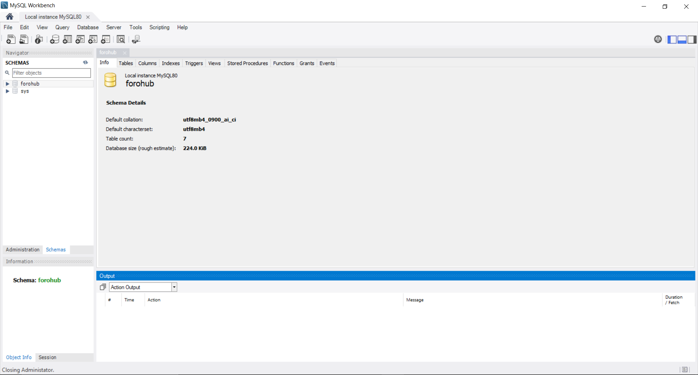
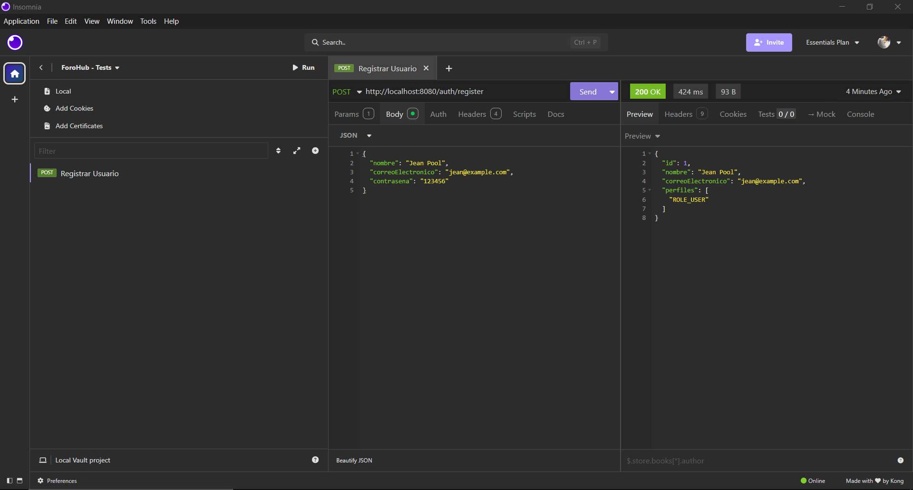
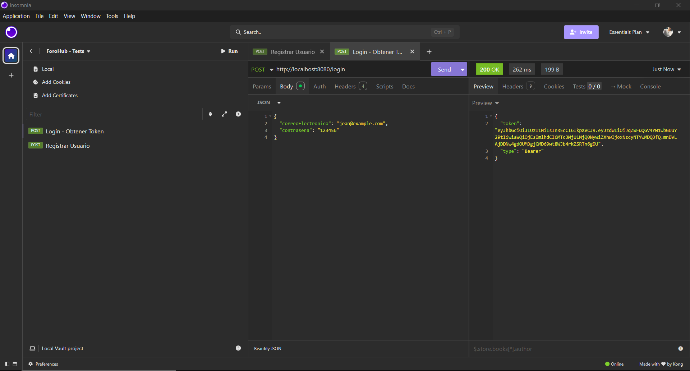
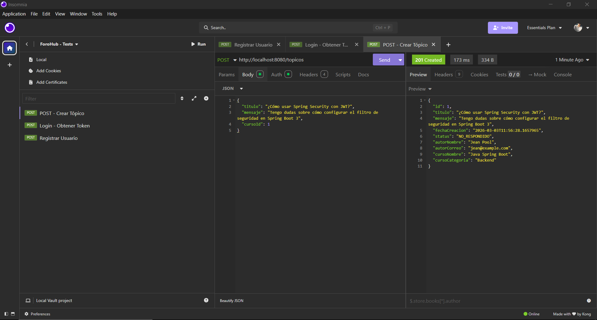
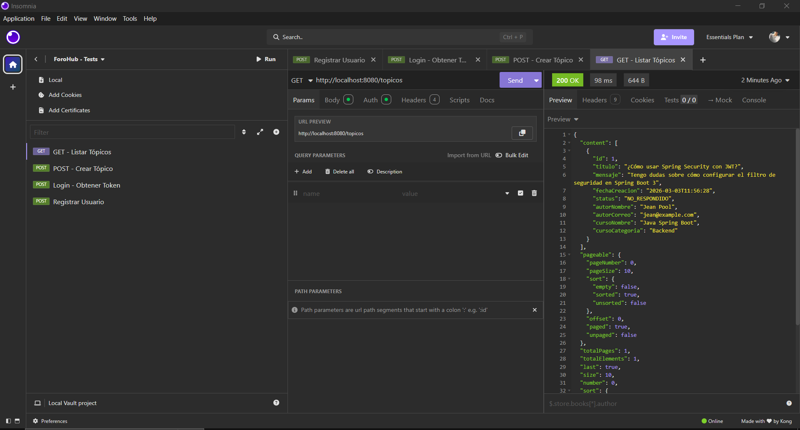
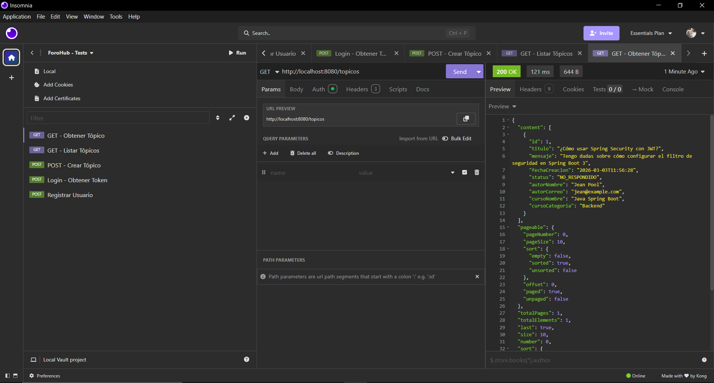
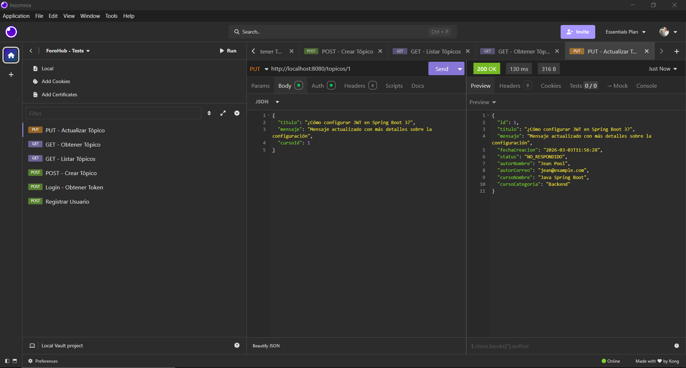
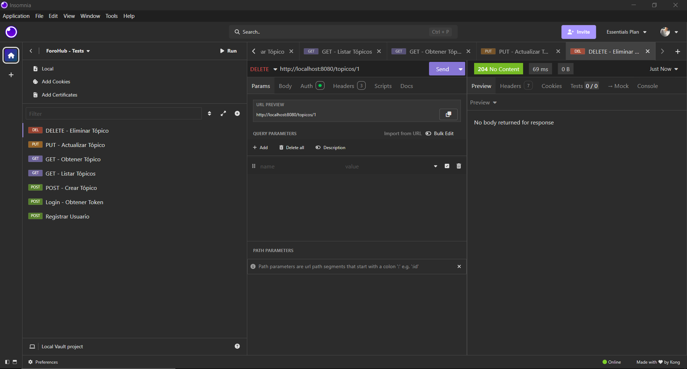

# 🚀 ForoHub API – Backend Challenge

API REST profesional desarrollada con **Java 17 + Spring Boot 3.5.11** para el reto ForoHub de Alura. Replica el backend de un sistema de foro con autenticación JWT, CRUD de tópicos, validaciones de negocio y persistencia MySQL.

---
## 📸 Capturas del Proyecto ForoHub

---

## 🧠 1️⃣ Código Principal (Spring Boot)

<p align="center">
  
</p>

---

## 🗄 2️⃣ Configuración Base de Datos MySQL

<p align="center">
  
</p>

---

# 🔐 Pruebas de Autenticación

## ✅ Test 1 – Registrar Usuario

<p align="center">
  
</p>

---

## ✅ Test 2 – Login y Obtener Token JWT

<p align="center">
  
</p>

---

# 📝 Pruebas CRUD de Tópicos

## ✅ Test 3 – Crear Tópico

<p align="center">
  
</p>

---

## ✅ Test 4 – Listar Tópicos

<p align="center">
  
</p>

---

## ✅ Test 5 – Obtener Tópico por ID

<p align="center">
  
</p>

---

## ✅ Test 6 – Actualizar Tópico

<p align="center">
  
</p>

---

## ✅ Test 7 – Eliminar Tópico

<p align="center">
  
</p>

---

## 🛠️ Tecnologías Utilizadas

| Tecnología | Versión |
|------------|---------|
| Java | 17 |
| Spring Boot | 3.5.11 |
| Spring Security | 6.x |
| Spring Data JPA | 3.x |
| MySQL | 8.x |
| Flyway | 10.x |
| Auth0 Java JWT | 4.4.0 |
| Lombok | Latest |
| Maven | 3.x |

---

## ⚙️ Configuración del Entorno

### 1. Prerrequisitos

- Java 17 instalado
- MySQL 8.x corriendo en el **puerto 3307** (no el default 3306)
- Maven 3.x instalado

### 2. Configurar Base de Datos

Crea la base de datos en MySQL Workbench (puerto 3307):
```sql
CREATE DATABASE IF NOT EXISTS forohub 
  CHARACTER SET utf8mb4 COLLATE utf8mb4_unicode_ci;
```

> ⚠️ **Importante:** El proyecto usa el puerto **3307**, no el 3306.

### 3. Configurar `application.properties`

```properties
spring.datasource.url=jdbc:mysql://localhost:3307/forohub?createDatabaseIfNotExist=true&useSSL=false&allowPublicKeyRetrieval=true
spring.datasource.username=root
spring.datasource.password=TU_PASSWORD_AQUI

spring.jpa.hibernate.ddl-auto=validate
spring.jpa.show-sql=true
spring.jpa.properties.hibernate.format_sql=true

jwt.secret=clave_super_secreta_para_el_proyecto_de_forohub_alura_2026
jwt.expiration=3600000
```

### 4. Ejecutar el Proyecto

```bash
git clone https://github.com/GV-JeanPool/ForoHub-Challenge-BackEnd.git
cd forohub
mvn spring-boot:run
```

Flyway ejecutará automáticamente las migraciones y creará todas las tablas al iniciar.

---

## 🗄️ Diagrama de Base de Datos

```
┌─────────────┐       ┌──────────────┐       ┌──────────────┐
│   USUARIO   │       │    TOPICO    │       │    CURSO     │
├─────────────┤       ├──────────────┤       ├──────────────┤
│ id (PK)     │──┐    │ id (PK)      │       │ id (PK)      │
│ nombre      │  └───>│ autor_id(FK) │   ┌──>│ nombre       │
│ correo      │       │ curso_id(FK) │───┘   │ categoria    │
│ contrasena  │  ┌───>│ titulo       │       └──────────────┘
└─────────────┘  │    │ mensaje      │
       │         │    │ fecha_creacion│
       │         │    │ status       │       ┌──────────────┐
       ▼         │    │ UNIQUE(titulo│       │    PERFIL    │
┌─────────────┐  │    │  ,mensaje)   │       ├──────────────┤
│USUARIO_PERFIL│  │   └──────────────┘       │ id (PK)      │
├─────────────┤  │                           │ nombre       │
│usuario_id   │  │    ┌──────────────┐       └──────────────┘
│perfil_id    │  │    │   RESPUESTA  │
└─────────────┘  │    ├──────────────┤
                 │    │ id (PK)      │
                 └───>│ autor_id(FK) │
                      │ topico_id(FK)│
                      │ mensaje      │
                      │ fecha_creacion│
                      │ solucion     │
                      └──────────────┘
```

---

## 🔐 Autenticación con JWT

### Registrar un usuario
**`POST /auth/register`**

```json
// Request Body
{
  "nombre": "Juan Pérez",
  "correoElectronico": "juan@example.com",
  "contrasena": "miPassword123"
}

// Response 200 OK
{
  "id": 1,
  "nombre": "Juan Pérez",
  "correoElectronico": "juan@example.com"
}
```

### Obtener Token JWT
**`POST /login`**

```json
// Request Body
{
  "correoElectronico": "juan@example.com",
  "contrasena": "miPassword123"
}

// Response 200 OK
{
  "token": "eyJhbGciOiJIUzI1NiIsInR5cCI6IkpXVCJ9..."
}
```

> Usa el token en todos los demás requests como header:
> `Authorization: Bearer eyJhbGci...`

---

## 📌 Endpoints – CRUD Tópicos

Todos los endpoints requieren autenticación JWT.

### `POST /topicos` – Crear tópico
```json
// Request Body
{
  "titulo": "¿Cómo usar Spring Security?",
  "mensaje": "Tengo problemas configurando Spring Security con JWT...",
  "cursoId": 1
}

// Response 201 Created
{
  "id": 1,
  "titulo": "¿Cómo usar Spring Security?",
  "mensaje": "Tengo problemas configurando Spring Security con JWT...",
  "fechaCreacion": "2026-03-02T22:00:00",
  "status": "NO_RESPONDIDO",
  "autorNombre": "Juan Pérez",
  "autorCorreo": "juan@example.com",
  "cursoNombre": "Java Spring Boot",
  "cursoCategoria": "Backend"
}
```

### `GET /topicos` – Listar tópicos (paginado)
```
GET /topicos?page=0&size=10&sort=fechaCreacion,asc
GET /topicos?curso=Java Spring Boot
```
```json
// Response 200 OK
{
  "content": [...],
  "totalElements": 5,
  "totalPages": 1,
  "number": 0,
  "size": 10
}
```

### `GET /topicos/{id}` – Obtener un tópico
```json
// Response 200 OK
{
  "id": 1,
  "titulo": "¿Cómo usar Spring Security?",
  ...
}

// Response 404 Not Found (si no existe)
{
  "status": 404,
  "error": "Not Found",
  "message": "Tópico no encontrado con ID: 99"
}
```

### `PUT /topicos/{id}` – Actualizar tópico
```json
// Request Body
{
  "titulo": "¿Cómo configurar JWT en Spring Boot?",
  "mensaje": "Mensaje actualizado...",
  "cursoId": 1
}
// Response 200 OK
```

### `DELETE /topicos/{id}` – Eliminar tópico
```
// Response 204 No Content
```

---

## ⚠️ Códigos de Respuesta HTTP

| Código | Descripción |
|--------|-------------|
| 200 | OK |
| 201 | Tópico creado exitosamente |
| 204 | Tópico eliminado exitosamente |
| 400 | Datos inválidos o tópico duplicado |
| 401 | Token JWT inválido o credenciales incorrectas |
| 404 | Tópico o curso no encontrado |

---

## 📋 Reglas de Negocio

1. **Todos los campos son obligatorios** al crear un tópico
2. **No se permiten duplicados**: la combinación `titulo + mensaje` debe ser única
3. **Solo usuarios autenticados** pueden acceder a los endpoints de tópicos
4. Al registrarse, el usuario recibe el rol **`ROLE_USER`** automáticamente

---

## 🧪 Cómo Probar con Insomnia/Postman

1. **Crear usuario** → `POST /auth/register`
2. **Login** → `POST /login` → copiar el token
3. **Configurar** el header `Authorization: Bearer <token>` en las demás peticiones
4. **Probar CRUD** de tópicos

---

## 🏗️ Arquitectura del Proyecto

```
src/main/java/com/gvjeanpool/forohub/
├── domain/
│   ├── dto/           # DTOs de request/response
│   ├── exception/     # Excepciones de negocio personalizadas
│   ├── model/         # Entidades JPA
│   ├── repository/    # Interfaces JpaRepository
│   └── service/       # Lógica de negocio
├── infrastructure/
│   ├── controller/    # Controladores REST
│   ├── exception/     # GlobalExceptionHandler
│   └── security/      # JWT, SecurityConfig, Filter
└── ForohubApplication.java
```

---

## 👨‍💻 Autor

**GV-JeanPool** – Reto ForoHub Challenge – Alura 2026  
🔗 [GitHub del Proyecto](https://github.com/GV-JeanPool/ForoHub-Challenge-BackEnd)
